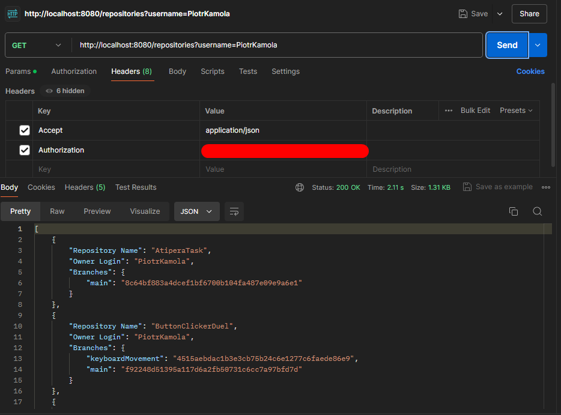

# AtiperaTask
Recruitment task for Atipera:  

As an api consumer, given username and header “Accept: application/json”, I would like to list all his github repositories, which are not forks. Information, which I require in the response, is:  

Repository Name  
Owner Login  
For each branch it’s name and last commit sha

As an api consumer, given not existing github user, I would like to receive 404 response in such a format: 
{
 
    &emsp; “status”: ${responseCode} 
    &emsp; “message”: ${whyHasItHappened} 
}
 
 
There is also option for Authorization token since there is limit for using github api, 
such token can be generated here https://github.com/settings/tokens 
and use on Postman like that:
